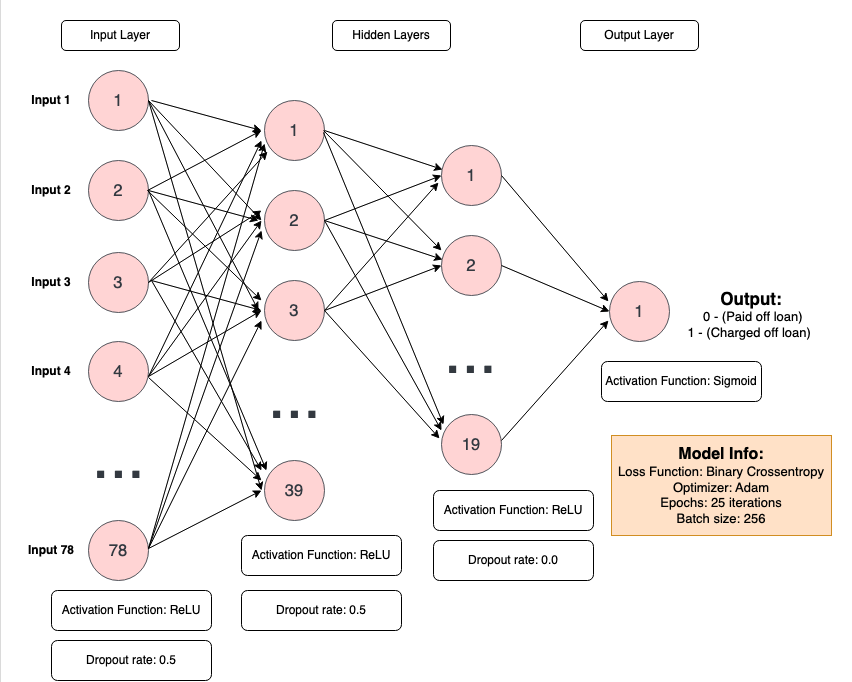

# Python-Machine-Learning

### In these two projects, I have leveraged the power of Natural Language Processing (NLP) and Recurrent Neural Net (RNN) models to accurately predict categorical features within two datasets.

# Natural Language Processing (NLP) Project:
Given a dataset of Yelp reviews from [Kaggle](https://www.kaggle.com/c/yelp-recsys-2013), I used exploratory data analysis and implemented an NLP model using the Python sklearn library in order to determine based on a review, whether it was positive (5-star) or negative (1-star).
* 0   business_id  10000 non-null  object
* 1   date         10000 non-null  object
* 2   review_id    10000 non-null  object
* 3   stars        10000 non-null  int64 <------------ Predict this classification (1 star or 5 star)
* 4   text         10000 non-null  object
* 5   type         10000 non-null  object
* 6   user_id      10000 non-null  object
* 7   cool         10000 non-null  int64 
* 8   useful       10000 non-null  int64 
* 9   funny        10000 non-null  int64 

## Project Overview
* Graph distributions of each Yelp review by stars (1-5) and text length
* Find if any strong correlations lie in the data using a heatmap
* Separate the data into train/test splits & use CountVectorizer() function to remove any stopwords from the reviews
* Implement and train a Pipeline model that uses a MultinomialNB classifier and Tf-idf transformer
* Create a classification report & confusion matrix to determine the accuracy of the model

## Model Conclusion:
The model had an accuracy f1-score of 0.81, meaning, given a text Yelp review, the model had approximately an 81% chance of guessing right whether it was a 5-star or 1-star review.

# Recurrent Neural Net (RNN) Project:
Given a dataset from Kaggle for [loan details](https://www.kaggle.com/wordsforthewise/lending-club), I use exploratory data analysis, data pre-processing, and an RNN model using TensorFlow to determine if a person would be able to pay off a loan (loan_status column) given other factors from: 
* 0   loan_amnt             396030 non-null  float64
* 1   term                  396030 non-null  object 
* 2   int_rate              396030 non-null  float64
* 3   installment           396030 non-null  float64
* 4   grade                 396030 non-null  object 
* 5   sub_grade             396030 non-null  object 
* 6   emp_title             373103 non-null  object 
* 7   emp_length            377729 non-null  object 
* 8   home_ownership        396030 non-null  object 
* 9   annual_inc            396030 non-null  float64
* 10  verification_status   396030 non-null  object 
* 11  issue_d               396030 non-null  object 
* 12  loan_status           396030 non-null  object          <------------ Predict this classification (fully paid or charged off)
* 13  purpose               396030 non-null  object 
* 14  title                 394275 non-null  object 
* 15  dti                   396030 non-null  float64
* 16  earliest_cr_line      396030 non-null  object 
* 17  open_acc              396030 non-null  float64
* 18  pub_rec               396030 non-null  float64
* 19  revol_bal             396030 non-null  float64
* 20  revol_util            395754 non-null  float64
* 21  total_acc             396030 non-null  float64
* 22  initial_list_status   396030 non-null  object 
* 23  application_type      396030 non-null  object 
* 24  mort_acc              358235 non-null  float64
* 25  pub_rec_bankruptcies  395495 non-null  float64
* 26  address

## Project Overview:
* Use scatterplots, count-plots,  and heatmaps to find correlations within the dataset
* Analyze missing data and either normalize or delete them based on correlations with non-empty cols
* Create dummy variables for the remaining columns for the training algorithm
* Drop columns that give no useful information
* Separate data into train/test splits and create scale the data using a MinMaxScaler() function
* Use Tensorflow to create a Recurrent Neural Network model
* Fit the model with the train data and make predictions using test split & plot model history performance
* Create a classification report & confusion matrix to determine the accuracy of the model

## Model Diagram:

## Model Conclusion:
The model had an accuracy f1-score of 0.89, meaning, given information about a user from a dataset, the model had approximately an 89% chance of guessing right whether a person can pay off a loan or have to be charged off.

# Following Python Libraries Used:
* NumPy
* Pandas
* Matplotlib
* Seaborn
* Plotly
* Sklearn
* TensorFlow
* Keras

